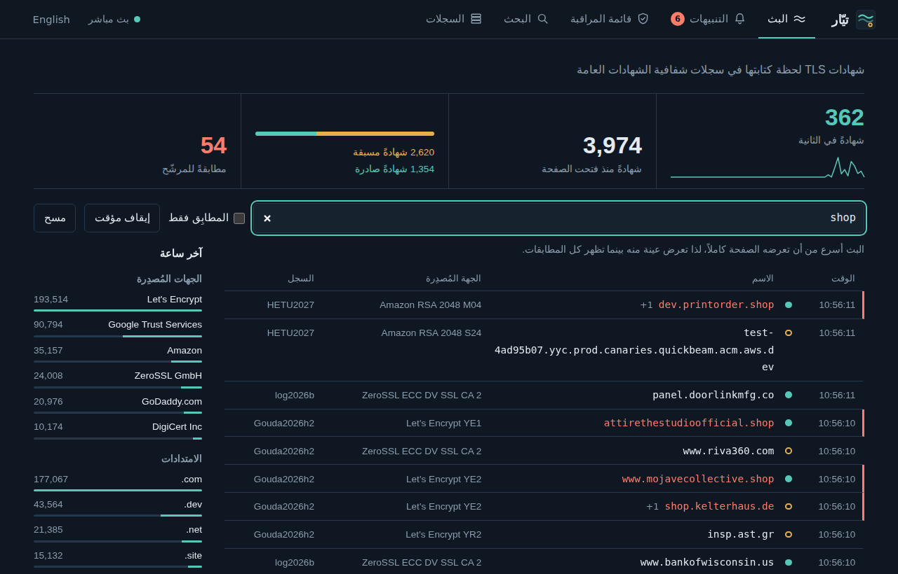
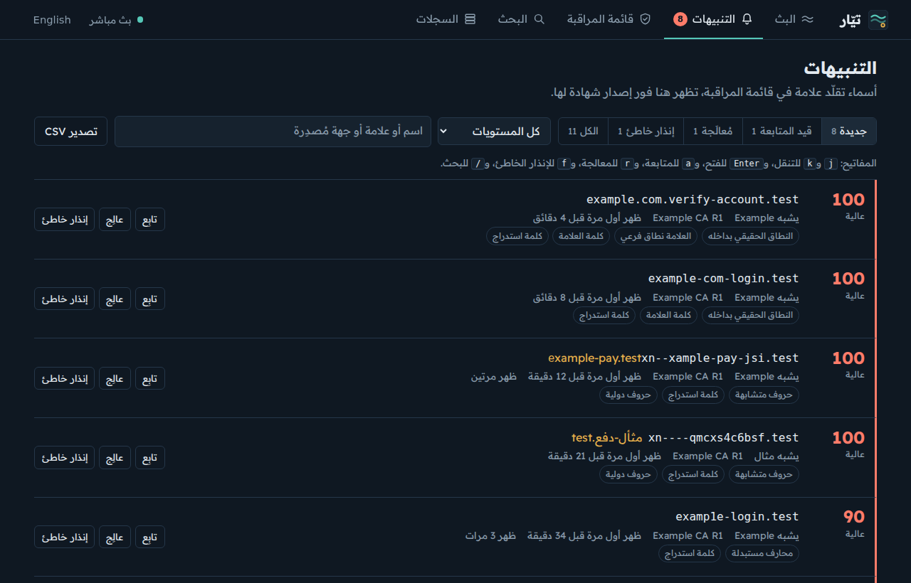
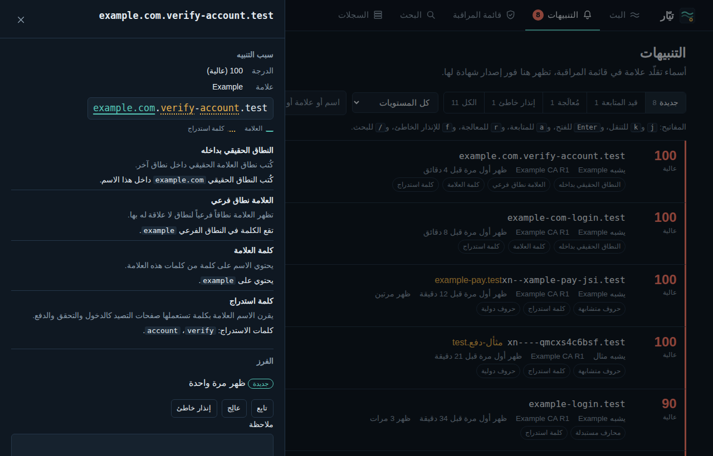
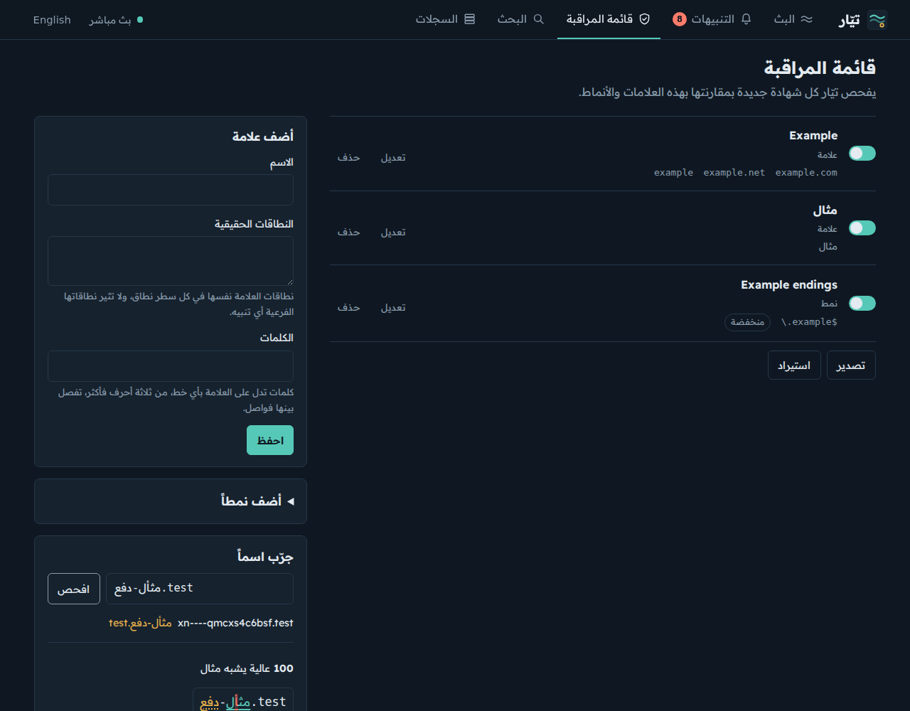
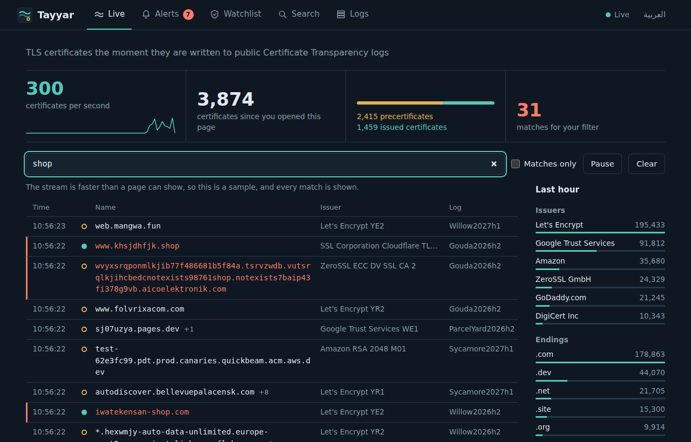
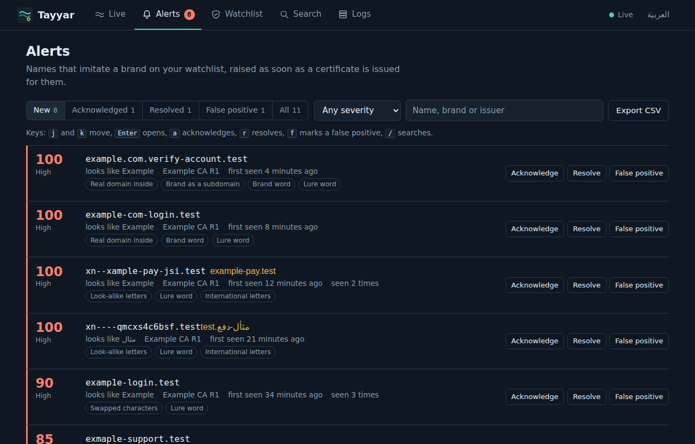
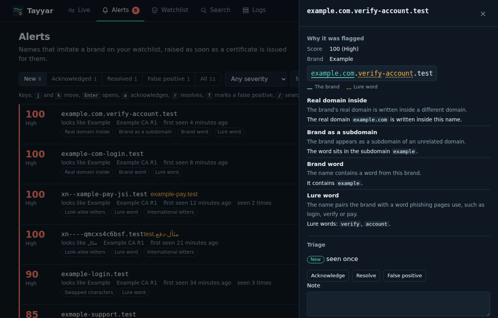
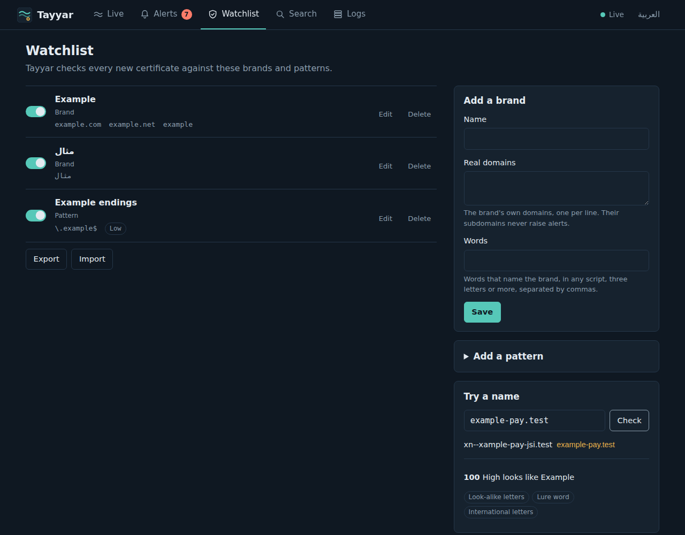
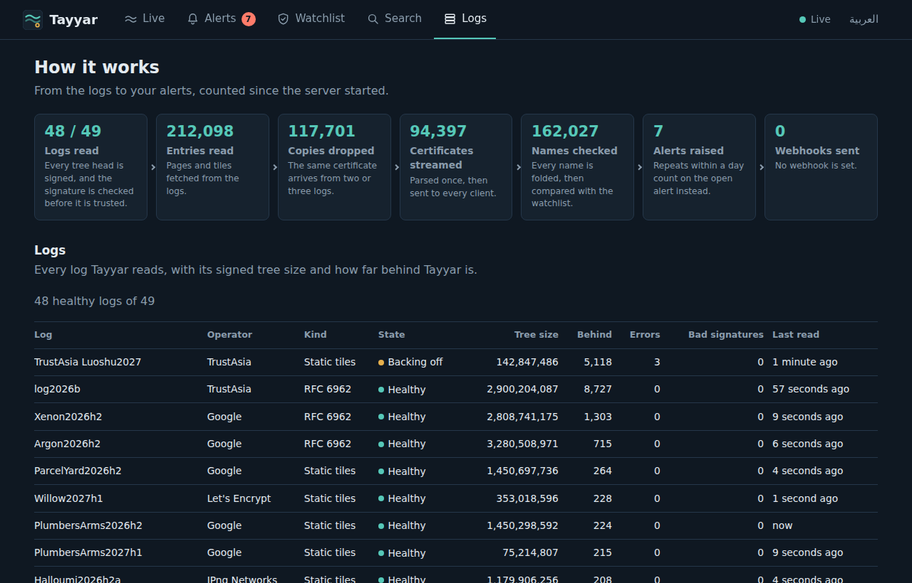

# تيّار · Tayyar

**[tayyar.3li.info](https://tayyar.3li.info)**

<div dir="rtl">

**تيّار** أداة مفتوحة المصدر تقرأ سجلات شفافية الشهادات العامة باستمرار، فتبث كل شهادة TLS جديدة لحظة تسجيلها وتفحص كل اسم فيها بمقارنته بقائمة مراقبتك، لذا تكشف نطاقات التصيد وانتحال العلامات لحظة إصدار شهاداتها بواجهة كاملة بالعربية والإنجليزية.

تجد الموقع والشاشات على [tayyar.3li.info](https://tayyar.3li.info) بالعربية والإنجليزية.



## ما يقدّمه

يقرأ تيّار نوعي السجلات معاً، أي السجلات التي تتبع RFC 6962 والسجلات الثابتة، ويتحقق من توقيع كل رأس شجرة قبل أن يثق بحجمها، ثم يبث الشهادات عبر WebSocket دون أي مكتبة خارجية.

ويكشف الأسماء التي تقلّد علاماتك بحروف من خطوط أخرى أو بأرقام مكان الحروف أو بأخطاء إملائية أو بامتداد آخر أو بنطاقك الحقيقي مكتوباً داخل نطاق آخر، بالإضافة إلى أنه يوحّد الحروف العربية المتشابهة كالكاف الفارسية والعربية والياء والألف المقصورة.

ولكل تنبيه درجة من مئة وأسباب مشروحة بكلمات واضحة وحالة تنقله فيها من جديد إلى قيد المتابعة ثم إلى مُعالَج أو إنذار خاطئ، مع ملاحظاتك وتصدير CSV واستعلام DNS عند الطلب.

ويرسل التنبيهات الجديدة إلى عناوين الويب بصيغة JSON أو نص، ويوقّع كل رسالة بمفتاح سري حتى يتأكد المستقبِل من مصدرها.

علاوة على ذلك تبحث في آخر نصف مليون شهادة، وترى أكثر الجهات إصداراً في الساعة الأخيرة وحالة كل سجل ومقدار التأخر عنه.

## الشاشات







## كيف يعمل

يجلب تيّار القائمة العامة للسجلات الموثوقة ويختار منها ما يقبل الشهادات اليوم، ثم يشغّل لكل سجل عاملاً مستقلاً يقرأ رأس الشجرة الموقَّع ويتحقق من توقيعه، فإن كبرت الشجرة جلب المدخلات الجديدة إما عبر `get-entries` وإما من ملفات tile.

بعد ذلك يحذف تيّار النسخ المكررة لأن كل شهادة تُسجَّل في سجلين أو ثلاثة، ثم يحلل الشهادة مرة واحدة ويبثها، بينما يتعلم من ردود كل سجل حجم الدفعة التي يقبلها ويخفف ضغطه إن ردّ السجل بالرمز 429 ثم يرفعه تدريجياً، لذا يواكب السجلات المزدحمة دون أن يثقل عليها.

ثم يفحص كل اسم في الشهادة بمقارنته بقائمة المراقبة، فإن شابه علامة رفع تنبيهاً بدرجته وأسبابه وأرسله إلى عناوين الويب، بينما يُحسب ظهور الاسم نفسه خلال يوم تكراراً للتنبيه المفتوح لا تنبيهاً جديداً.

وفي تجربة حية بتاريخ 25 سبتمبر 2026 قرأ تيّار 49 سجلاً، فبث نحو 1,200 شهادة فريدة في الثانية مستهلكاً قرابة ربع نواة واحدة من المعالج.

## التشغيل

يعمل تيّار على Node 22 أو أحدث دون أي مكتبة خارجية، ولا يحتاج إلى تثبيت إذ يكفي تشغيله عبر npx، ثم تفتح العنوان المحلي وتضيف علاماتك إلى قائمة المراقبة من الواجهة، بينما يحفظ الخيار `--data` القائمة والتنبيهات بين مرات التشغيل:

</div>

```sh
npx github:SiteQ8/Tayyar serve --data ./tayyar-data
# http://127.0.0.1:4000/
```

<div dir="rtl">

وحين يصل إليه غيرك فاحمِه برمز وصول لا يقل عن اثني عشر حرفاً، ويمكنك أن ترسل التنبيهات إلى عنوان ويب يوقّع تيّار رسائله إليه:

</div>

```sh
TAYYAR_TOKEN='a long random secret' npx github:SiteQ8/Tayyar serve \
  --host 0.0.0.0 --data /var/lib/tayyar \
  --webhook text:https://example.com/hooks/tayyar --webhook-secret 'another secret'
```

<div dir="rtl">

ومن سطر الأوامر تجرّب الأسماء بمقارنتها بملف قائمة مراقبة، أو تتابع البث فيطبع ما يقلّد علاماتك فقط:

</div>

```sh
npx github:SiteQ8/Tayyar check --watchlist watchlist.json examp1e-pay.test
npx github:SiteQ8/Tayyar watch --watchlist watchlist.json --format json
npx github:SiteQ8/Tayyar watch --keyword shop,bank --match '\.kw$'
npx github:SiteQ8/Tayyar logs --probe
```

<div dir="rtl">

تجد المسارات وحقول الرسائل وواجهة البرمجة في القسم الإنجليزي أدناه لأنها أسماء تقنية لا تتغير بين اللغتين، وكلها مثبتة باختبارات تفشل إن تغيّر أي حقل منها.

## الأمان والخصوصية

لا ترسل الواجهة أي طلب إلى طرف ثالث ولا تحمّل خطوطاً من الخارج، ويستمع الخادم على العنوان المحلي ما لم تطلب غير ذلك، فإن ضبطت رمز الوصول طلبه لكل قراءة وكل تغيير وكل بث.

ولا يقبل الخادم أي تغيير إلا من الصفحة نفسها، ولا يستعلم عن DNS لأي اسم إلا حين تطلب ذلك أو تشغّل الخيار `--resolve`، لأن الاستعلام قد يُعلم صاحب النطاق بأن أحداً سأل عنه.

## التطوير

تُفرض قواعد المشروع باختبارات تفشل عند مخالفتها، ومنها مطابقة العدد والمعدود في الواجهة العربية وخلوّ الجمل العربية من النقاط في وسطها وخلوّ الملفات من الشرطات الطويلة وثبات حقول الرسائل واكتمال الموقع باللغتين، وتعمل كلها دون اتصال لأنها تستخدم بيانات حقيقية سُجّلت من السجلات:

</div>

```sh
npm test
npm run preflight
```

<div dir="rtl">

## الترخيص

الشيفرة متاحة بترخيص MIT.

</div>

## What it is

**Tayyar** (Arabic for a current, as in a stream) is an open source tool that reads the public Certificate Transparency logs continuously, streams every new TLS certificate the moment it is logged, and checks every name on it against your watchlist. Names that imitate your brands become alerts with a score, the reasons in plain words, and a status you work through, in a full interface in Arabic and English.

The site, with screenshots, is at [tayyar.3li.info](https://tayyar.3li.info).



## What sets it apart

- Look-alike detection that understands Arabic. Names are folded before they are compared: Cyrillic, Greek and Armenian letters that look Latin, letters with marks, full width letters, the Persian kaf and yeh, the dotless yeh, teh marbuta and Arabic digits all map to one form.
- Alerts you can work through: new, acknowledged, resolved or false positive, with notes, CSV export and a DNS lookup on demand. The same name seen again within a day counts as a repeat, not a new alert.
- Signed webhooks, as the full alert in JSON or as a short `{"text": ...}` message.
- Both kinds of CT log: RFC 6962 logs, and static CT API logs served as tiles, with each log's signature checked on every tree head.
- No dependencies. Node 22 or later, and it listens on 127.0.0.1 unless told otherwise.

## Screens









## How it works

1. It loads Google's public list of trusted CT logs and keeps the logs that accept certificates today: usable or qualified, with a temporal shard that is current.
2. It runs one watcher per log. Each watcher reads the signed tree head (`get-sth`, or `/checkpoint` for static CT logs) and checks the log's signature on it.
3. It fetches the new entries: `get-entries` from RFC 6962 logs, data tiles and `/issuer/` from static CT logs.
4. It drops the copies of a certificate that arrive from other logs, parses each certificate once, and broadcasts it.
5. It checks every name on the certificate against the watchlist, and raises an alert when one imitates a watched brand.

Watchers learn each log's page size from its answers (some logs return 32 entries per call, most return 256), pipeline requests while catching up, halve their concurrency when a log answers 429, and jump to the newest entries when they fall too far behind, so the stream stays live.

In a live run on 25 September 2026, Tayyar read 49 logs and published about 1,200 unique certificates per second using about a quarter of one CPU core.

## Run it

Node 22 or later, no dependencies:

```sh
npx github:SiteQ8/Tayyar serve --data ./tayyar-data           # interface at http://127.0.0.1:4000/
TAYYAR_TOKEN='a long random secret' npx github:SiteQ8/Tayyar serve --host 0.0.0.0 --data /var/lib/tayyar
npx github:SiteQ8/Tayyar check --watchlist watchlist.json examp1e-pay.test https://example.com.verify-account.test/login
npx github:SiteQ8/Tayyar watch --watchlist watchlist.json --format json > alerts.jsonl
npx github:SiteQ8/Tayyar watch --keyword shop,bank --match '\.kw$'
npx github:SiteQ8/Tayyar logs --probe
```

`tayyar --help` lists every option. The ones for `serve`:

| Option | What it does |
|---|---|
| `--data <dir>` | keeps `watchlist.json`, `alerts.jsonl` and the log positions in this folder; without it they live in memory |
| `--token <secret>` | requires this access token, at least 12 characters; `$TAYYAR_TOKEN` works too |
| `--webhook <url>` | posts new alerts here, as `json:URL` (the default) or `text:URL`; repeat it for more |
| `--webhook-min <level>` | the lowest severity to post: `low`, `medium` (the default) or `high` |
| `--webhook-secret <s>` | signs every webhook body with HMAC SHA-256 |
| `--resolve` | looks up the DNS records of every new alert |
| `--history <n>` | certificates kept for search, 500,000 by default |

A watchlist file for `check` and `watch` has the same shape the interface exports:

```json
{
  "items": [
    { "kind": "brand", "name": "Example", "domains": ["example.com"], "keywords": ["example"] },
    { "kind": "pattern", "name": "Kuwait domains", "pattern": "\\.kw$", "severity": "low" }
  ]
}
```

## How names are scored

A brand has its real domains, whose names and subdomains never raise alerts, and words that name it in any script. Each finding scores up to 100: high from 80, medium from 60, low below.

| Reason | Score | When |
|---|---|---|
| `embedded-domain` | 90 | the brand's real domain is written inside another domain, as in `example.com.verify-account.test` |
| `homoglyph` | 85 | the name matches only once look-alike letters are folded |
| `tld-swap` | 75 | the brand's name under a different ending |
| `swap` | 75 | digits or letter pairs stand in for letters, such as `0` for `o` or `rn` for `m` |
| `typo` | 55 to 70 | one or two letters away from the brand; a four letter brand also needs a lure word |
| `keyword` | 55 | a brand word in the name; words under five letters must start a word |
| `subdomain` | plus 10 | the brand word sits in a subdomain of an unrelated name |
| `lure-word` | plus 15 | the name also carries a word such as login, verify, pay, parcel or fines, or an Arabic one such as دفع |
| `idn` | plus 5 | the name is internationalised |
| `pattern` | 45, 65 or 85 | a regular expression on the watchlist matched, at its low, medium or high severity |

## Endpoints

| Path | What it sends |
|---|---|
| `/` (WebSocket) | `certificate_update` messages without the DER bytes or the chain |
| `/full-stream` (WebSocket) | the same messages with `as_der` and the chain |
| `/domains-only` (WebSocket) | `dns_entries` messages with the names only |
| `/alerts` (WebSocket) | `alert` messages for new alerts, and `alert_update` when one changes |
| `/latest.json` | the 25 most recent certificates, oldest first |
| `/example.json` | the most recent certificate in full |
| `/stats` | engine, log and client figures |
| `/healthz` | liveness for load balancers |
| `/api/...` | the interface's API, below |

With a token set, every path except `/healthz` and the interface's own files needs a session cookie from `POST /api/session` or an `Authorization: Bearer <token>` header.

## Messages

Every certificate is published as one `certificate_update` message. These fields are fixed by the tests, so a client can rely on them:

| Field | Meaning |
|---|---|
| `message_type` | `certificate_update`, `dns_entries` or `heartbeat` |
| `data.update_type` | `X509LogEntry` for an issued certificate, `PrecertLogEntry` for a precertificate |
| `data.cert_index` | the entry's index in its log |
| `data.cert_link` | where the entry can be fetched from its log |
| `data.seen` | when Tayyar published it, in Unix seconds |
| `data.source` | the log's `name` and `url` |
| `data.leaf_cert.all_domains` | the names the certificate covers |
| `data.leaf_cert.subject` and `data.leaf_cert.issuer` | `C`, `ST`, `L`, `O`, `OU`, `CN`, `emailAddress` and `aggregated` |
| `data.leaf_cert.not_before` and `data.leaf_cert.not_after` | validity, in Unix seconds |
| `data.leaf_cert.serial_number` | the serial in hex |
| `data.leaf_cert.signature_algorithm` | for example `sha256, ecdsa` |
| `data.leaf_cert.is_ca` | whether the certificate may issue others |
| `data.leaf_cert.fingerprint`, `data.leaf_cert.sha1` and `data.leaf_cert.sha256` | hashes of the DER bytes |
| `data.leaf_cert.extensions` | decoded extensions such as `subjectAltName` and `keyUsage` |
| `data.leaf_cert.as_der` and `data.chain` | on `/full-stream` only |

A heartbeat arrives every 30 seconds. Clients do not need to send pings: the server pings them and drops connections that stop answering. This runs in a browser or in Node 22:

```js
const ws = new WebSocket('ws://127.0.0.1:4000/');
ws.onmessage = (event) => {
  const message = JSON.parse(event.data);
  if (message.message_type === 'certificate_update') console.log(message.data.leaf_cert.all_domains);
};
```

An alert message carries the alert as `data`: its `id`, `severity`, `score`, `reasons`, `domain`, `unicode` form when the name is internationalised, the `watch` entry it imitates, `status`, `note`, `count`, `created_at`, `last_seen`, `dns` once looked up, and `cert` with the issuer, validity, all names, the log and the entry's index and link.

## API

| Request | What it does |
|---|---|
| `GET`, `POST`, `DELETE /api/session` | whether sign-in is needed; sign in with `{"token": "..."}`; sign out |
| `GET /api/overview` | rate, logs, alert counts and the watchlist size |
| `GET /api/logs` | every log with its state, tree size and lag |
| `GET /api/insights` | the last hour by minute, with the top issuers and endings |
| `GET /api/search?q=&type=all` | the recent stream; `type` is `all`, `pre` or `crt` |
| `GET`, `POST`, `PUT /api/watchlist` | list the entries, add one, or replace them all |
| `PATCH`, `DELETE /api/watchlist/:id` | change or remove an entry |
| `POST /api/watchlist/test` | check `{"domain": "..."}`, a name or a pasted link, against the watchlist |
| `GET /api/alerts?status=new&severity=all&q=` | alerts, newest first, with counts |
| `GET /api/alerts.csv` | the same alerts as CSV, with spreadsheet formulas defused |
| `PATCH /api/alerts/:id` | set `status` and `note` |
| `POST /api/alerts/:id/dns` | look the name up in DNS |

Every change needs the `x-tayyar-request: 1` header and, from a browser, the same origin, so a page on another site cannot make one.

## Webhooks

`json:` posts `{"event": "alert", "alert": {...}}`. `text:` posts `{"text": "[high] examp1e-pay.test looks like Example, score 90 (...)"}`, which chat tools with incoming webhooks accept. Failed deliveries are retried after 5 and 30 seconds. With `--webhook-secret`, check the signature before trusting a body:

```js
import { createHmac, timingSafeEqual } from 'node:crypto';

function signed(rawBody, header, secret) {
  const want = Buffer.from(`sha256=${createHmac('sha256', secret).update(rawBody).digest('hex')}`);
  const got = Buffer.from(header ?? '');
  return got.length === want.length && timingSafeEqual(got, want);
}
```

## Security and privacy

The interface makes no third-party requests and loads no web fonts. The server listens on 127.0.0.1 unless told otherwise. With an access token, sessions live in an `HttpOnly`, `SameSite=Strict` cookie, wrong tokens are limited to ten a minute per address, and changes are refused without the `x-tayyar-request` header. Names are looked up in DNS only when you ask, or with `--resolve`, because a lookup can tell the domain's owner that someone asked. The server limits WebSocket clients per address (`--max-per-ip`), disconnects clients that cannot keep up rather than slowing everyone down, and serves its pages with a strict Content Security Policy. Everything it streams is already public in the logs.

## Development

```sh
npm test            # unit and end-to-end tests, offline
npm run preflight   # syntax, secret scan and README links, then the tests
```

The tests run offline against real data recorded from public CT logs: part of a static CT data tile with its issuers, `get-entries` output, and signed tree heads. Project rules are enforced by failing tests rather than by review: Arabic number agreement in the interface, no full stop in the middle of an Arabic sentence, no long dashes anywhere, message fields that match this document, and a site that is complete in both languages.

## License

MIT
